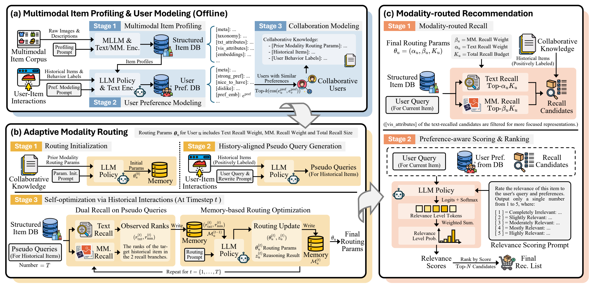

# AdaM-Rec: Adaptive Modality Routing for Multimodal Recommendation



Abstract: *While recent multimodal recommender systems have demonstrated the effectiveness of incorporating visual and textual information to improve downstream performance, most existing methods rely on static modality fusion, assuming that the relative importance of textual and visual signals remains stable across recommendation scenarios. This design may not fully account for an important variation across recommendation requests: some queries require fine-grained visual cues, whereas others are better served by textual or functional semantics, in which case indiscriminate modality fusion brings in uninformative cues and impairs recommendation quality. To address this, we propose AdaM-Rec, an LLM-based framework for adaptive modality routing in multimodal recommendation, which enables dynamic calibration of reliance on textual and multimodal evidence for user-specific queries. Built on structured natural-language representations of items and user preferences, it estimates modality reliability using proxy recall tasks. Specifically, it generates pseudo-queries that match the granularity of the actual query while pointing to the user's positively interacted items as verifiable proxy targets, evaluating which modality yields better recall performance in analogous scenarios and optimizing the routing strategy in an agentic manner. It then performs routed recall with optimized strategy, enriches results with collaborative items, and ranks candidates by their relevance to both the query and user preferences. Experiments demonstrate that AdaM-Rec delivers strong performance against state-of-the-art baselines, highlighting the effectiveness and broader potential of adaptive control over modality reliance in multimodal recommendation.*

# Getting Started

**Clone the repository:**

```bash
git clone https://github.com/RomGai/AdaM-Rec.git
cd AdaM-Rec
```

**Install the required dependencies:**

Use Python 3.10 or later and install a CUDA-compatible build of PyTorch and torchvision for your machine. Then install the remaining dependencies:

```bash
python -m pip install -r requirements.txt
```

# Data

The repository includes `query_data1.csv` and `metadata.csv` for Amazon Beauty, Clothing, and Music, sourced from [TAIRA](https://github.com/Alcein/TAIRA).

Metadata is downloaded and prepared as needed; local files are reused.

# Inference and Evaluation

**Start the profiling server:**

In a separate Linux environment, install vLLM and start the server. This is a starting configuration for one A100 80GB:

```bash
python -m pip install "vllm>=0.17.0"
CUDA_VISIBLE_DEVICES=0 vllm serve Qwen/Qwen3.5-9B \
  --tensor-parallel-size 1 \
  --gpu-memory-utilization 0.45 \
  --max-model-len 32768 \
  --max-num-seqs 16 \
  --reasoning-parser qwen3
```

Agent 1/2 use vLLM; routing, preference inference, and logits-based ranking use the local Transformers backbone. Both backbone instances occupy GPU memory; the server configuration above leaves room for the pipeline's other models. Adjust memory allocation and concurrency to fit your workload.

**Run the pipeline:**

From the repository root in the pipeline environment:

```bash
python run_pipe.py --dataset beauty
python run_pipe.py --dataset clothing
python run_pipe.py --dataset music
```

Profiling uses 16 concurrent requests and reuses cached profiles. Set `--profile-concurrency` to adjust concurrency or `--vllm-base-url` to change the default server address (`http://127.0.0.1:8000/v1`). Authenticated servers read the client key from `VLLM_API_KEY`.

**Enable visual item profiling:**

```bash
python run_pipe.py --dataset beauty --enable-vl-profiling
```

By default, item profiles are generated from text to quickly build usable profiles. Add `--enable-vl-profiling` to include product images.
